# LinkUp — Complete Architecture Documentation

> **Project:** LinkUp (LinkedIn-style HackerRank PBR Fixture)  
> **Version:** 1.0.0  
> **Last Updated:** 2025-05-15  
> **Status:** Production-Ready  
> **Classification:** Interview Assessment Platform

---

## Document Information

| Attribute | Value |
|-----------|-------|
| **Purpose** | Comprehensive architecture documentation for the LinkUp social networking platform |
| **Audience** | Development team, system architects, interview candidates, stakeholders |
| **Scope** | Full-stack architecture including backend services, frontend application, data layer, and infrastructure |
| **Maintainer** | LinkUp Development Team |
| **Review Cycle** | Quarterly |

---

## Table of Contents

1. [Introduction](#1-introduction)
2. [Architecture Principles](#2-architecture-principles)
3. [System Overview](#3-system-overview)
4. [High-Level Architecture](#4-high-level-architecture)
5. [Backend Architecture](#5-backend-architecture)
6. [Frontend Architecture](#6-frontend-architecture)
7. [Data Layer Architecture](#7-data-layer-architecture)
8. [Caching Strategy](#8-caching-strategy)
9. [Background Processing](#9-background-processing)
10. [Security Architecture](#10-security-architecture)
11. [API Design](#11-api-design)
12. [Performance & Scalability](#12-performance--scalability)
13. [Quality Attributes](#13-quality-attributes)
14. [Architecture Decision Records](#14-architecture-decision-records)
15. [Feature Implementation Matrix](#15-feature-implementation-matrix)
16. [Appendices](#16-appendices)

---

## 1. Introduction

### 1.1 Purpose and Scope

This document provides a comprehensive overview of the LinkUp platform architecture, a LinkedIn-style social networking fixture designed for HackerRank Plan-Build-Review (PBR) interview assessments.

**Platform Constraints:**
- **Runtime Environment:** Single-user HackerRank Workspace VM
- **Session Duration:** 45-60 minutes per candidate
- **Deployment Model:** Ephemeral, per-candidate instances
- **Scale:** Single-user workload (no multi-user racing concerns)
- **Data:** Seeded fixture data, reset between sessions

### 1.2 System Context

LinkUp operates as a self-contained web application with the following external dependencies:

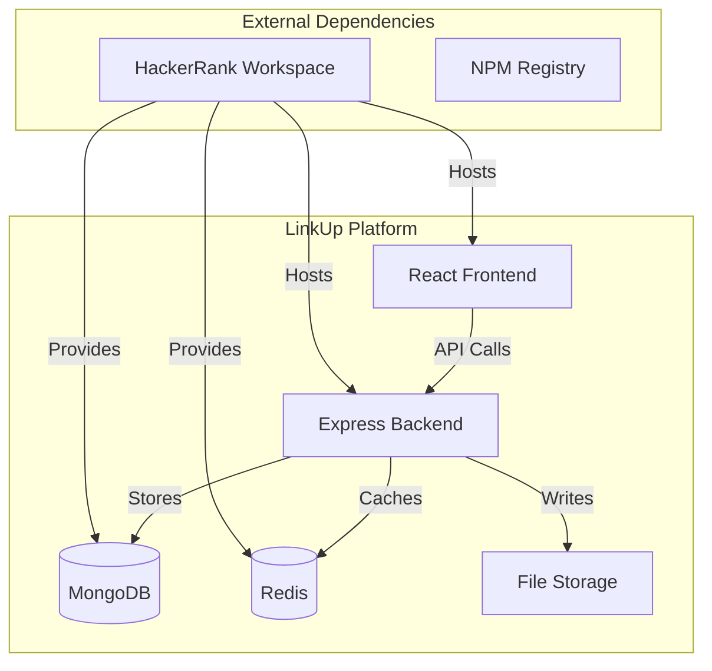

**Not Implemented by Design:**
- Email Services (SMTP, SendGrid)
- SMS Services (Twilio)
- Cloud Storage (S3, CloudFront)
- OAuth Providers (Google, LinkedIn)
- Third-party Webhooks

### 1.3 Glossary

| Term | Definition |
|------|------------|
| **PBR** | Plan-Build-Review: A three-phase interview methodology |
| **HRW** | HackerRank Workspace: The containerized interview environment |
| **BullMQ** | Redis-backed queue system for background jobs |
| **RTK Query** | Redux Toolkit Query: Data fetching and caching library |
| **Cursor Pagination** | Pagination using opaque tokens instead of page numbers |
| **Fanout** | Asynchronous notification distribution pattern |
| **PBR Seam** | Intentional architectural weakness for candidate task surfaces |

---

## 2. Architecture Principles

### 2.1 Core Design Principles

#### P1: Interview-First Design
Architecture choices prioritize interviewability over production scalability.

**Rationale:** Candidates have 45-60 minutes to understand and modify the system

**Implication:** No distributed systems complexity, no third-party service dependencies

**Trade-off:** Some patterns (e.g., KEYS-based cache invalidation) are intentionally naive

#### P2: Layered Separation
Strict separation between routes, controllers, services, and data access layers.

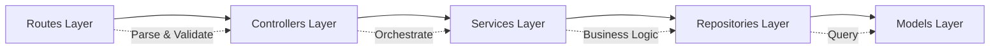

#### P3: Feature-First Organization
Code is organized by business domain, not technical layer.

- **Benefits:** Clear boundaries, easier navigation for candidates
- **Structure:** `features/<domain>/{routes,controller,service,model}.js`

#### P4: Graceful Degradation
Cache and infrastructure failures never break the primary user flow.

```javascript
// Pattern: Always wrap cache operations
try {
  const cached = await cache.get(key);
  if (cached) return cached;
} catch (err) {
  req.log.warn({ err }, 'Cache miss - treating as failure');
}
// Fall through to primary data source
```

#### P5: Opacity at Boundaries
Internal implementation details are hidden behind clean interfaces.

- **Pagination:** Cursors are opaque base64url tokens
- **Caching:** Cache keys follow documented patterns only
- **API:** Errors follow consistent `{ code, message }` format

### 2.2 Quality Attribute Priorities

| Priority | Attribute | Target |
|----------|-----------|--------|
| **1** | **Modifiability** | Candidates can add features in <30 minutes |
| **2** | **Understandability** | New contributors productive in <15 minutes |
| **3** | **Reliability** | Zero data loss, graceful cache failures |
| **4** | **Performance** | Page loads <2s, API responses <500ms |
| **5** | **Testability** | E2E suite covers critical user paths |

---

## 3. System Overview

### 3.1 Technology Stack

#### Backend Stack

| Layer | Technology | Version | Purpose |
|-------|-----------|---------|---------|
| **Runtime** | Bun | Latest | Fast JavaScript execution |
| **Framework** | Express | 5.x | HTTP server and routing |
| **Database** | MongoDB | 7.x | Document storage with replica set |
| **ORM/ODM** | Mongoose | 8.x | Data modeling and validation |
| **Cache/Queue** | Redis | 7.x | Caching and job queue storage |
| **Job Processing** | BullMQ | 5.34 | Background job queues |
| **Validation** | Zod | 4.x | Schema validation |
| **Security** | Helmet, bcryptjs, jsonwebtoken | Latest | Security headers and auth |
| **Logging** | Pino | Latest | Structured JSON logging |
| **File Upload** | Multer, Sharp | Latest | Multipart handling, image processing |
| **API Docs** | Swagger/JSDoc | OpenAPI 3.0 | Interactive API documentation |

#### Frontend Stack

| Layer | Technology | Version | Purpose |
|-------|-----------|---------|---------|
| **Framework** | React | 19.x | UI framework |
| **Build Tool** | Vite | 6.x | Fast dev server and optimized builds |
| **Routing** | React Router | 7.x | Client-side routing |
| **State Management** | Redux Toolkit + RTK Query | Latest | Global state and API caching |
| **Styling** | Tailwind CSS | 4.x (beta) | Utility-first CSS framework |
| **Components** | Radix UI | Latest | Accessible component primitives |
| **Icons** | Lucide React | Latest | Icon library |
| **Rich Text** | Tiptap | 3.x | WYSIWYG editor with mentions |
| **Forms** | React Hook Form | Latest | Form state management |
| **Notifications** | Sonner | Latest | Toast notifications |
| **Date Utilities** | date-fns | Latest | Date formatting and manipulation |

### 3.2 Project Structure

```
linkup/
├── backend/                    # Express + Mongoose backend
│   ├── src/
│   │   ├── features/          # 16 feature modules
│   │   ├── shared/            # Infrastructure & utilities
│   │   ├── workers/           # Background workers
│   │   ├── app.js             # Express app setup
│   │   └── index.js           # Application entry
│   └── uploads/               # File storage
│
├── frontend/                   # React 19 + Vite 6 frontend
│   ├── src/
│   │   ├── features/          # 17 feature modules
│   │   ├── components/        # Shared UI components
│   │   ├── hooks/             # Custom React hooks
│   │   ├── lib/               # Utilities
│   │   ├── store/             # Redux store
│   │   └── main.jsx           # Application entry
│   └── public/                # Static assets
│
├── docs/                       # Documentation
├── tests/                      # E2E tests (Playwright)
├── setup.sh                    # HRW integration script
└── package.json                # Root package (Bun workspaces)
```

### 3.3 Communication Patterns

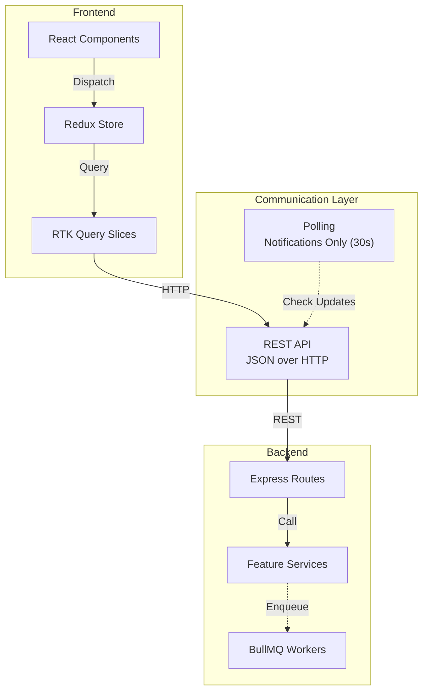

---

## 4. High-Level Architecture

### 4.1 System Architecture

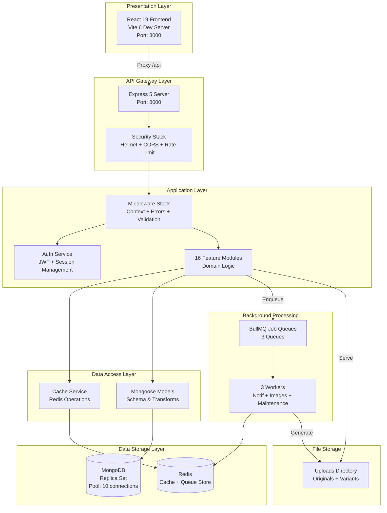

### 4.2 Request Processing Flow

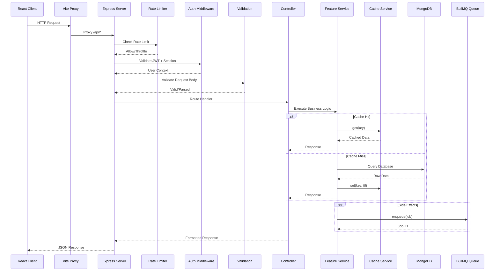

### 4.3 Component Interaction Matrix

| Layer | Calls | Is Called By | Data Format |
|-------|-------|--------------|-------------|
| **React Components** | RTK Query hooks | User events | JSX, Props |
| **RTK Query Slices** | HTTP API | Components | JSON (camelCase) |
| **Express Routes** | Controllers | HTTP requests | Express Request |
| **Controllers** | Services | Routes | Plain JS objects |
| **Services** | Repositories, Models | Controllers | Mongoose documents |
| **Repositories** | Mongoose queries | Services | Mongoose Query |
| **Models** | MongoDB | Services/Repos | BSON (snake_case) |

---

## 5. Backend Architecture

### 5.1 Layered Architecture Pattern

The backend follows a strict layered architecture where each layer has a single responsibility:

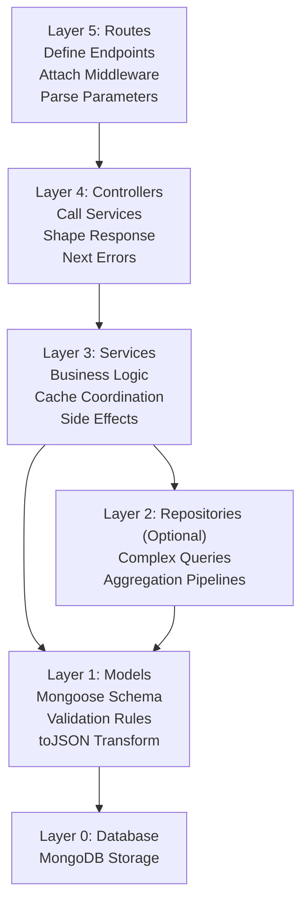

#### Layer Responsibilities

| Layer | Responsibility | Must Not |
|-------|---------------|----------|
| **Routes** | Define endpoints, attach middleware, parse params | Contain business logic |
| **Controllers** | Call services, shape response, pass errors | Access database directly |
| **Services** | Business logic, caching, authorization, side effects | Format HTTP responses |
| **Repositories** | Complex queries, aggregations | Contain business logic |
| **Models** | Schema definition, validation, transforms, cascades | Access external services |

### 5.2 Middleware Pipeline

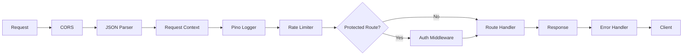

#### Middleware Order & Purpose

| Order | Middleware | Purpose | Configuration |
|-------|-----------|---------|---------------|
| 1 | CORS | Cross-origin resource sharing | Configurable origins |
| 2 | JSON Parser | Parse request bodies | Limit: 10mb |
| 3 | Request Context | Add request ID and logger | Nanoid for ID |
| 4 | Pino Logger | HTTP request logging | Structured JSON |
| 5 | Rate Limiter | Throttle requests | 3-tier strategy |
| 6 | Auth (conditional) | JWT + session resolution | Required/Optional |
| 7 | Validation | Zod schema validation | Per-route schemas |
| 8 | Error Handler | Centralized error handling | Last in stack |

### 5.3 Feature Modules

The backend is organized into 16 feature modules, each following the same structure:

```
features/<name>/
├── <name>.routes.js       # Route definitions
├── <name>.controller.js   # Request handlers
├── <name>.service.js      # Business logic
├── <name>.model.js        # Mongoose schema
├── <name>.validation.js   # Zod schemas
├── <name>.repository.js   # Optional: complex queries
└── index.js               # Barrel export: { router }
```

#### Feature Module Catalog

| Feature | Routes | Endpoints | Database Collections |
|---------|--------|-----------|----------------------|
| **auth** | `/api/auth/*` | 11 | User, Session |
| **post** | `/api/posts/*` | 7 | Post, SavedPost |
| **comment** | `/api/comments/*` | 5 | Comment, CommentReaction |
| **reaction** | `/api/reactions/*` | 1 | Reaction |
| **network** | `/api/network/*` | 19 | Follow, Mute, Block, ConnectionRequest |
| **notification** | `/api/notifications/*` | 4 | Notification |
| **user** | `/api/users/*` | 3 | User |
| **company** | `/api/companies/*` | 5 | Company, CompanyFollow |
| **job** | `/api/jobs/*` | 9 | Job, JobApplication, SavedJob |
| **upload** | `/api/uploads/*` | 3 | Upload |
| **message** | `/api/messages/*` | 2 | Conversation, Message |
| **search** | `/api/search/*` | 2 | Uses multiple collections |
| **analytics** | `/api/analytics/*` | 1 | Post, ProfileView, Reaction |
| **audit** | `/api/audit/*` | 1 | Audit |
| **account** | `/api/settings/account/*` | 3 | User |
| **maintenance** | N/A | Internal | Upload |

### 5.4 Shared Infrastructure

Shared infrastructure components are located in `backend/src/shared/`:

#### Core Services

| Module | Purpose | Key Functions | Usage Pattern |
|--------|---------|----------------|---------------|
| **cache.service** | Redis operations | `get()`, `set()`, `del()`, `invalidate()` | Never call `redis.*` directly |
| **notification.service** | Notification fanout | `fanout()`, `markRead()` | Always async via BullMQ |
| **ai.service** | Anthropic AI | `generateText()` | Pass system/user prompts separately |

#### Core Libraries

| Module | Purpose | Key Functions |
|--------|---------|----------------|
| **pagination.js** | Cursor pagination | `parseCursor()`, `buildEnvelope()`, `encodeCursor()` |
| **populate.js** | N+1 prevention | `populateMany()` with profile population |
| **regex.js** | Safe regex | `escapeRegex()` for user input |
| **sanitize.js** | HTML cleaning | `sanitize()`, `toPlain()` for rich text |
| **cards.js** | User cards | `toUserCard()`, `toCompanyCard()` |
| **errors.js** | Error handling | `AppError` class |
| **logger.js** | Structured logging | `baseLogger`, `auditLogger` |
| **transaction.js** | DB transactions | `withTransaction()` wrapper |

#### Middleware

| Module | Purpose | Exports |
|--------|---------|---------|
| **auth.middleware** | Authentication | `requireAuth`, `optionalAuth` |
| **validation.middleware** | Schema validation | `validate(zodSchema)` |
| **rateLimit.middleware** | Rate limiting | 3 pre-configured limiters |
| **requestContext.middleware** | Request tracking | Adds `req.requestId`, `req.log` |
| **error.middleware** | Error handling | Formats errors as JSON |

### 5.5 Error Handling Strategy

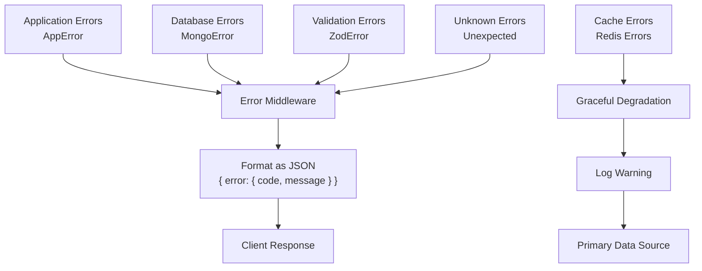

#### Error Response Format

All errors follow this consistent format:

```javascript
// Error Response Structure
{
  error: {
    code: "ERROR_CODE",        // Machine-readable identifier
    message: "Human-readable description",
    details: { ... }           // Optional: additional context
  }
}
```

---

## 6. Frontend Architecture

### 6.1 Component Architecture

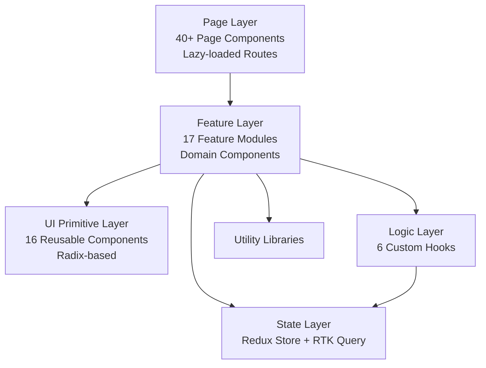

### 6.2 State Management Architecture

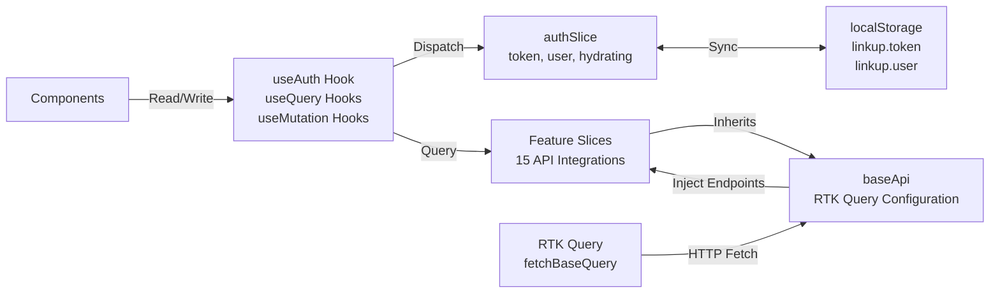

### 6.3 Routing Architecture

#### Route Categories

**Public Routes:**
- `/login` - Login page
- `/signup` - Signup page
- `/forgot-password` - Password recovery
- `/reset-password` - Password reset

**Protected Routes:**

| Category | Routes |
|----------|--------|
| **Home & Feed** | `/` (home feed), `/saved`, `/drafts`, `/posts/:id` |
| **Network** | `/mynetwork`, `/in/:id/mutual-connections` |
| **Notifications** | `/notifications` |
| **Messaging** | `/messages`, `/messages/:id` |
| **Profiles** | `/in/:id`, `/in/:id/edit`, `/in/:id/edit/skills`, etc. |
| **Companies** | `/company/:slug` |
| **Jobs** | `/jobs`, `/jobs/:id`, `/jobs/new`, `/jobs/applications`, `/jobs/saved` |
| **Search** | `/search` |
| **Analytics** | `/analytics` |
| **Settings** | `/settings`, `/settings/account`, `/settings/password`, etc. |

### 6.4 Feature Module Structure

Each frontend feature follows this structure:

```
features/<name>/
├── pages/                   # Route components
│   ├── <Feature>ListPage.jsx
│   ├── <Feature>DetailPage.jsx
│   └── <Feature>EditPage.jsx
├── components/              # Feature-specific components
│   ├── <Feature>Card.jsx
│   ├── <Feature>Form.jsx
│   └── <Feature>Modal.jsx
├── hooks/                   # Feature-specific hooks
│   └── use<Feature>.js
└── store/                   # RTK Query slice
    └── <feature>Api.js
```

### 6.5 Component Catalog

#### Layout Components

| Component | Purpose | Props |
|-----------|---------|-------|
| **AppShell** | Main layout wrapper | `{ children }` |
| **RequireAuth** | Authentication guard | `{ children, redirectTo }` |
| **ErrorBoundary** | Error catch-all | `{ fallback, children }` |
| **MobileBottomNav** | Mobile navigation | `{ activeRoute }` |

#### Editor Components

| Component | Purpose | Props |
|-----------|---------|-------|
| **RichTextEditor** | Tiptap v3 editor | `{ value, onChange, mentions }` |
| **EditorField** | Reusable wrapper | `{ label, error, ...editorProps }` |
| **MentionList** | @mention dropdown | `{ command, items }` |

#### Display Components

| Component | Purpose | Props |
|-----------|---------|-------|
| **RichContent** | Safe HTML rendering | `{ html, className }` |
| **CompanyLogo** | Logo with fallback | `{ slug, name, size }` |
| **PostImages** | Image gallery | `{ images, layout }` |

#### Feedback Components

| Component | Purpose | Props |
|-----------|---------|-------|
| **ListSkeleton** | Loading skeleton | `{ count, className }` |
| **ModalShell** | Dialog wrapper | `{ open, onOpenChange, children }` |
| **DropdownMenu** | Radix dropdown | `{ trigger, items }` |

#### Input Components

| Component | Purpose | Props |
|-----------|---------|-------|
| **SearchBar** | Debounced search | `{ value, onChange, placeholder }` |
| **VisibilitySelector** | Public/connections | `{ value, onChange }` |
| **ImagePicker** | Drag-drop upload | `{ images, onChange, max }` |

### 6.6 Custom Hooks

| Hook | Purpose | Dependencies |
|------|---------|--------------|
| **useAuth** | Auth operations wrapper | Redux authSlice |
| **useTheme** | Theme management | localStorage + MediaQuery |
| **useClickOutside** | Click-outside detection | useEffect + Ref |
| **useDebouncedValue** | Debounced input (250ms) | useState + useEffect |
| **useDocumentTitle** | Page title updates | useEffect |
| **useInfiniteScrollSentinel** | Infinite scroll trigger | IntersectionObserver |

---

## 7. Data Layer Architecture

### 7.1 Database Schema Overview

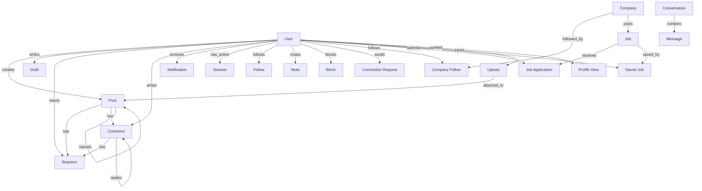

### 7.2 Collection Specifications

#### User Collection

**Purpose:** Store user account and profile information

**Key Fields:**

| Field | Type | Description |
|-------|------|-------------|
| `_id` | ObjectId | Primary key |
| `email` | String (unique) | Login email (lowercase) |
| `password_hash` | String | Bcrypt hash (never exposed) |
| `name` | String | Display name |
| `headline` | String | Professional headline |
| `bio` | String | About section |
| `avatar_url` | String | Profile picture URL |
| `custom_url` | String (unique sparse) | Profile URL slug |
| `skills` | Array | Professional skills |
| `experiences` | Array | Work history |
| `education` | Array | Education history |
| `profile_visibility` | String | 'public' or 'connections' |
| `notification_prefs` | Object | Per-type preferences |
| `created_at` | Date | Account creation date |

**Indexes:**
- `email` (unique)
- `custom_url` (unique, sparse)

#### Post Collection

**Purpose:** Store user posts, reposts, and quote posts

**Key Fields:**

| Field | Type | Description |
|-------|------|-------------|
| `_id` | ObjectId | Primary key |
| `author` | ObjectId (indexed) | Reference to User |
| `content` | String | Plain text content |
| `content_html` | String | Sanitized rich text |
| `images` | Array | Attached images |
| `visibility` | String | 'public' or 'connections' |
| `repost_of` | ObjectId (nullable) | Reference to Post |
| `impressions_count` | Number | View count |
| `created_at` | Date | Creation date |

**Indexes:**
- `{ visibility, created_at: -1 }` (feed queries)
- `{ author, created_at: -1 }` (profile feed)
- `{ author, repost_of }` (repost uniqueness)
- `content` (text index for search)

### 7.3 Indexing Strategy

#### Index Types

| Index Type | Purpose | Example |
|------------|---------|---------|
| **Single Field** | Fast lookups | `User.email` |
| **Compound** | Multi-field queries | `{ visibility, created_at }` |
| **Text** | Full-text search | `Post.content` |
| **Unique** | Uniqueness constraints | `User.email` |
| **Sparse Unique** | Optional unique | `User.custom_url` |

#### Index Catalog

| Collection | Index | Type | Rationale |
|------------|-------|------|-----------|
| **User** | `email` | Unique | Login lookups |
| **User** | `custom_url` | Unique sparse | Profile URL routing |
| **Post** | `{ visibility, created_at }` | Compound | Feed sorting + filtering |
| **Post** | `{ author, created_at }` | Compound | Profile feeds |
| **Post** | `{ author, repost_of }` | Compound | Repost uniqueness |
| **Post** | `content` | Text | Post search |
| **Notification** | `{ recipient, created_at }` | Compound | Inbox ordering |
| **Notification** | `{ recipient, dedupe_key }` | Unique sparse | Idempotency |
| **Job** | `{ title, description }` | Text | Job search |

### 7.4 Data Transformation Flow

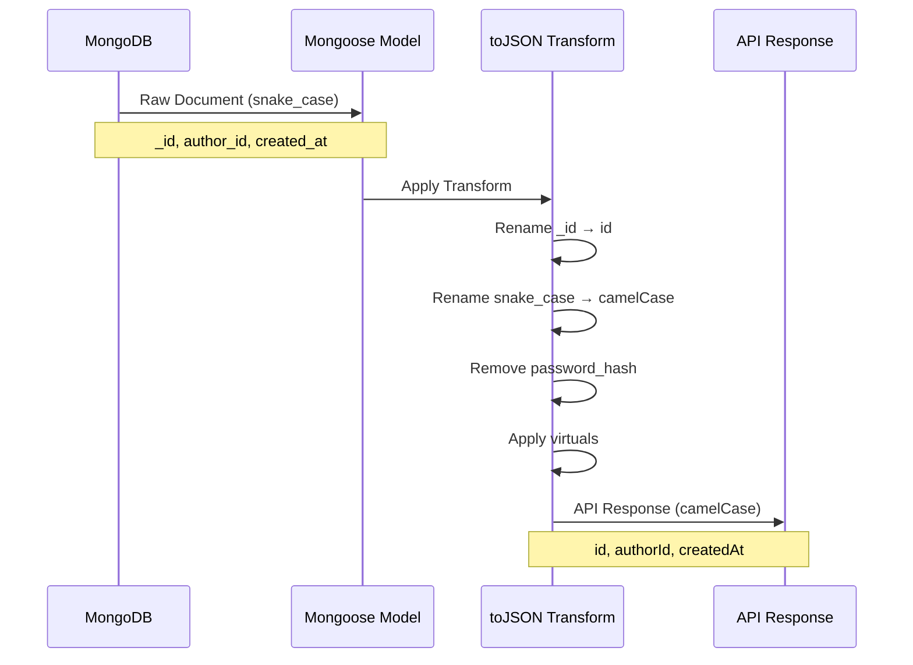

#### Transform Rules

| Database Field | API Field | Transform |
|----------------|-----------|-----------|
| `_id` | `id` | Rename |
| `author_id` | `authorId` | Rename + snake_case |
| `created_at` | `createdAt` | Rename + snake_case |
| `updated_at` | `updatedAt` | Rename + snake_case |
| `password_hash` | *(excluded)* | Remove |
| `__v` | *(excluded)* | Remove |

---

## 8. Caching Strategy

### 8.1 Cache Architecture

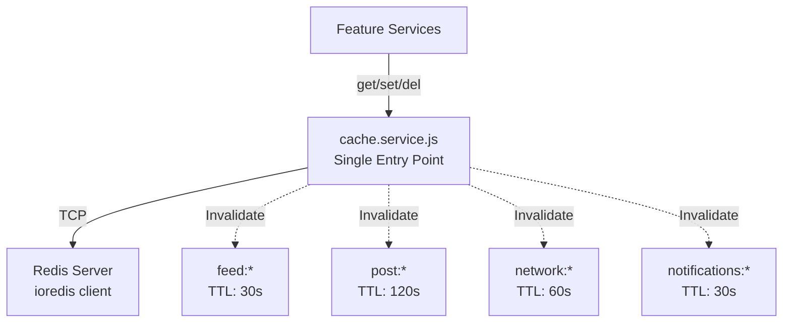

### 8.2 Cache Patterns

#### Cache-Aside (Lazy Loading)

```javascript
// Pattern: Check cache → DB → Backfill
async function getCachedPost(postId) {
  try {
    const cached = await cache.get(`post:${postId}`);
    if (cached) return JSON.parse(cached);
  } catch (err) {
    req.log.warn({ err, postId }, 'Cache get failed');
  }
  
  // Cache miss: fetch from DB
  const post = await Post.findById(postId);
  
  // Backfill cache (fire-and-forget)
  cache.set(`post:${postId}`, JSON.stringify(post), 120)
    .catch(err => req.log.warn({ err }, 'Cache set failed'));
  
  return post;
}
```

#### Write-Through Invalidation

```javascript
// Pattern: Invalidate cache on write
async function updatePost(postId, updates) {
  const post = await Post.findByIdAndUpdate(postId, updates, { new: true });
  
  // Invalidate all cache keys for this post
  await cache.invalidate(`post:author:${post.author}:*`);
  await cache.del(`post:${postId}`);
  
  return post;
}
```

### 8.3 Cache Key Design

#### Namespace Hierarchy

```
linkup:
├── feed:
│   ├── home:public:{cursor}
│   ├── profile:{userId}:{cursor}
│   └── saved:{userId}:{cursor}
├── post:
│   ├── {postId}
│   └── author:{authorId}:*
├── network:
│   ├── relationship:{viewerId}:{targetId}
│   └── suggestions:{viewerId}
└── notifications:
    └── unread:{userId}
```

#### TTL Strategy

| Cache Type | TTL | Rationale |
|------------|-----|-----------|
| **Home feed** | 30s | High churn, needs freshness |
| **Profile feed** | 60s | Medium churn |
| **Single post** | 120s | Low churn, high read ratio |
| **Network relationships** | 60s | Medium churn |
| **Notifications unread** | 30s | Real-time expectations |
| **Suggestions** | 60s | Expensive to compute |

### 8.4 Graceful Degradation

All cache operations are wrapped in try-catch and log warnings on failure:

```javascript
// Pattern: Never throw on cache errors
try {
  const cached = await cache.get(key);
  if (cached) return cached;
} catch (err) {
  req.log.warn({ err, key }, 'Cache miss - treating as failure');
  // Continue: fetch from primary data source
}
```

---

## 9. Background Processing

### 9.1 Queue Architecture

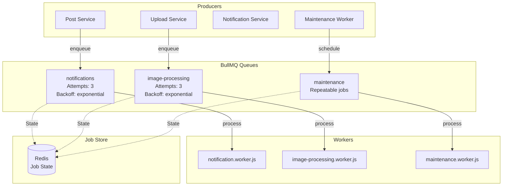

### 9.2 Worker Specifications

#### Notification Worker

**Purpose:** Fan out notifications to multiple recipients

**Job Schema:**
```javascript
{
  type: String,              // 'post_reaction', 'post_comment', etc.
  actor_id: ObjectId,        // User who triggered the notification
  recipient_ids: [ObjectId], // Target users
  subject: {                 // Notification subject
    type: String,            // 'post', 'comment', etc.
    id: ObjectId
  },
  dedupe_key: String         // Prevent duplicates
}
```

**Processing Logic:**
1. Parse job payload
2. Check recipient notification preferences
3. Filter out disabled types
4. Bulk insert with dedupe (unique sparse index)
5. Log results

**Retry Strategy:**
- Max attempts: 3
- Backoff: Exponential starting at 1s
- Dedupe key prevents duplicate notifications

#### Image Processing Worker

**Purpose:** Generate thumbnail variants for uploaded images

**Job Schema:**
```javascript
{
  uploadId: ObjectId,
  filename: String
}
```

**Processing Logic:**
1. Fetch upload record from DB
2. Read original image from disk
3. Generate thumbnail (200px max dimension)
4. Generate medium variant (800px max dimension)
5. Save to uploads/variants/
6. Update upload record: processed = true

**Retry Strategy:**
- Max attempts: 3
- Backoff: Exponential starting at 2s
- On final failure: mark upload as failed

#### Maintenance Worker

**Purpose:** Scheduled maintenance tasks

**Jobs:**

| Job | Schedule | Logic |
|-----|----------|-------|
| **Orphan Upload Sweep** | Every 15 min | Delete uploads with `committed: false` older than 1 hour |
| **Cache Refresh** | Every 5 min | Warm cache by calling GET /api/feed/home |

### 9.3 Job Lifecycle

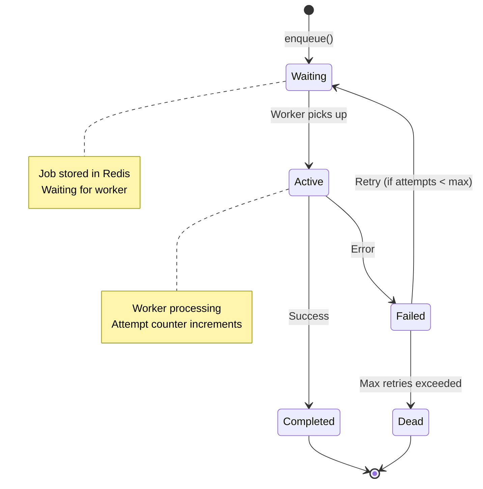

---

## 10. Security Architecture

### 10.1 Security Layers

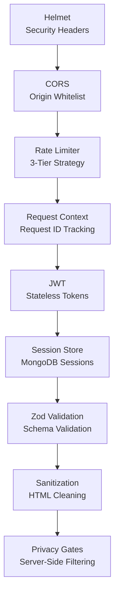

### 10.2 Authentication Flow

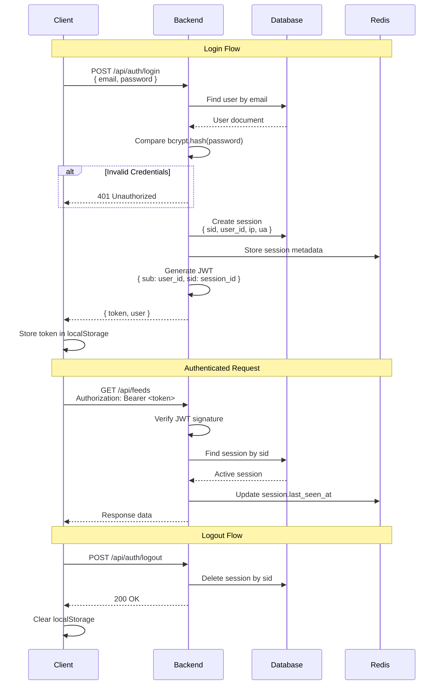

### 10.3 Rate Limiting Strategy

#### Three-Tier Rate Limiting

| Tier | Limit | Window | Scope | Routes |
|------|-------|--------|-------|--------|
| **Global** | 300 requests | 15 minutes | IP address | All routes |
| **Auth** | 15 requests | 15 minutes | IP address | Login, signup |
| **Sensitive Auth** | 5 requests | 60 minutes | IP address | Password reset |

#### Rate Limit Response

```javascript
// Rate Limit Exceeded Response
{
  error: {
    code: "RATE_LIMIT_EXCEEDED",
    message: "Too many requests. Please try again later.",
    details: {
      retryAfter: 123  // Seconds until retry
    }
  }
}
```

### 10.4 Privacy Enforcement

#### Visibility Levels

| Level | Behavior | Implementation |
|-------|----------|----------------|
| **public** | Anyone can view | No filtering |
| **connections** | Only 1st-degree connections | Filter in service layer |

#### Privacy Filter Pattern

```javascript
// Pattern: Server-side privacy enforcement
async function getProfile(viewerId, profileId) {
  const profile = await User.findById(profileId);
  
  if (profile.profile_visibility === 'connections') {
    const isConnected = await areConnected(viewerId, profileId);
    if (!isConnected) {
      // Return minimal "restricted" profile
      return toRestrictedProfile(profile);
    }
  }
  
  return profile;
}
```

### 10.5 Audit Logging

#### Dual Sink Audit

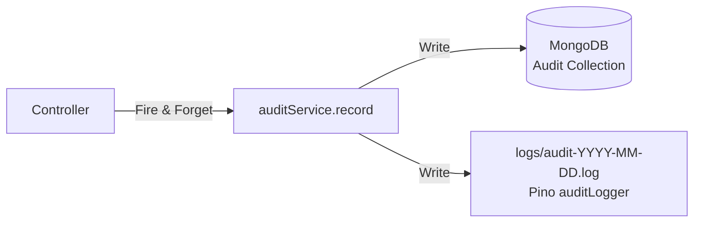

#### Audit Record Schema

```javascript
{
  actor: ObjectId,              // User who performed action
  action: String,               // 'user.login', 'post.create', etc.
  resource_type: String,        // 'User', 'Post', etc.
  resource_id: ObjectId,        // Affected resource
  ip_address: String,
  user_agent: String,
  success: Boolean,
  details: {},                  // Action-specific context
  created_at: Date
}
```

---

## 11. API Design

### 11.1 RESTful Conventions

#### URL Structure

```
/api/{resource}/{id}/{sub-resource}/{sub-id}/{action}
```

**Examples:**
- `/api/posts` - List/create posts
- `/api/posts/:id` - Get/update/delete post
- `/api/posts/:id/repost` - Repost action
- `/api/posts/:id/comments` - List comments
- `/api/comments/:id` - Get/update/delete comment

#### HTTP Methods

| Method | Purpose | Idempotent | Safe |
|--------|---------|------------|------|
| **GET** | Fetch resource | Yes | Yes |
| **POST** | Create resource | No | No |
| **PATCH** | Partial update | Yes | No |
| **PUT** | Full replace | Yes | No |
| **DELETE** | Delete resource | Yes | No |

### 11.2 Response Format

#### Success Response

```javascript
// Single Resource
{
  data: {
    id: "507f1f77bcf86cd799439011",
    authorId: "507f1f77bcf86cd799439012",
    content: "Hello, world!",
    createdAt: "2025-05-15T10:30:00.000Z"
  }
}

// Collection with Pagination
{
  data: [...],
  pagination: {
    nextCursor: "eyJjcmVhdGVkQXQiOiIyMDI1LTA1LTE1VDEw...",
    hasMore: true
  }
}
```

#### Error Response

```javascript
{
  error: {
    code: "RESOURCE_NOT_FOUND",
    message: "The requested resource was not found.",
    details: {
      resource: "Post",
      id: "507f1f77bcf86cd799439011"
    }
  }
}
```

### 11.3 Standard Error Codes

| Code | HTTP Status | Description |
|-----|-------------|-------------|
| `VALIDATION_ERROR` | 400 | Request validation failed |
| `UNAUTHORIZED` | 401 | Authentication required |
| `FORBIDDEN` | 403 | Authorization failed |
| `RESOURCE_NOT_FOUND` | 404 | Resource does not exist |
| `RESOURCE_CONFLICT` | 409 | Resource already exists |
| `RATE_LIMIT_EXCEEDED` | 429 | Too many requests |
| `INTERNAL_ERROR` | 500 | Server error |

### 11.4 API Route Catalog

#### Authentication Routes (`/api/auth/*`)

| Route | Method | Description |
|-------|--------|-------------|
| `/login` | POST | Login with email/password |
| `/signup` | POST | Create new account |
| `/logout` | POST | Logout and invalidate session |
| `/me` | GET | Get current user |
| `/reset-password` | POST | Request password reset |
| `/change-password` | POST | Change password (authenticated) |
| `/deactivate` | POST | Deactivate account |
| `/reactivate` | POST | Reactivate account |
| `/me` | DELETE | Permanently delete account |
| `/sessions` | GET | List active sessions |
| `/sessions` | DELETE | Logout all sessions |

#### Post Routes (`/api/posts/*`)

| Route | Method | Description |
|-------|--------|-------------|
| `/` | POST | Create new post |
| `/:id` | GET | Get post by ID |
| `/:id` | PATCH | Update post |
| `/:id` | DELETE | Delete post |
| `/:id/repost` | POST | Create repost |
| `/:id/repost` | DELETE | Remove repost |
| `/:id/save` | POST | Save post |
| `/:id/save` | DELETE | Unsave post |

#### Feed Routes (`/api/feed/*`)

| Route | Method | Description |
|-------|--------|-------------|
| `/home` | GET | Get home feed |
| `/:userId` | GET | Get user's profile feed |
| `/saved` | GET | Get saved posts feed |

#### Network Routes (`/api/network/*`)

| Route | Method | Description |
|-------|--------|-------------|
| `/follow/:id` | POST | Follow user |
| `/follow/:id` | DELETE | Unfollow user |
| `/mute/:id` | POST | Mute user |
| `/mute/:id` | DELETE | Unmute user |
| `/block/:id` | POST | Block user |
| `/block/:id` | DELETE | Unblock user |
| `/relationship/:id` | GET | Get relationship status |
| `/suggestions` | GET | Get connection suggestions |
| `/connections/invite/:id` | POST | Send connection invite |
| `/connections/invitations/:id/accept` | POST | Accept invite |
| `/connections/invitations/:id/decline` | POST | Decline invite |
| `/connections/:id` | DELETE | Remove connection |

#### Notification Routes (`/api/notifications/*`)

| Route | Method | Description |
|-------|--------|-------------|
| `/` | GET | Get notification inbox |
| `/unread-count` | GET | Get unread count |
| `/mark-all-read` | POST | Mark all as read |
| `/:id/read` | PATCH | Mark as read |

### 11.5 OpenAPI Documentation

All API endpoints are documented using JSDoc annotations with `@openapi` tags. The documentation is automatically generated and available at:

- **Interactive UI:** `http://localhost:8000/api/docs`
- **JSON Spec:** `http://localhost:8000/api/docs.json`

---

## 12. Performance & Scalability

### 12.1 Performance Characteristics

#### Target Metrics

| Metric | Target | Measurement |
|--------|--------|-------------|
| **First Contentful Paint** | <1.5s | Lighthouse |
| **Time to Interactive** | <3s | Lighthouse |
| **API Response (p50)** | <200ms | Server logs |
| **API Response (p95)** | <500ms | Server logs |
| **DB Query (p50)** | <50ms | MongoDB profiler |
| **Cache Hit Ratio** | >70% | Redis stats |

#### Optimization Strategies

| Layer | Strategy | Implementation |
|-------|----------|----------------|
| **Frontend** | Code splitting | Lazy-loaded routes |
| **Frontend** | Image optimization | Async variant generation |
| **Frontend** | State caching | RTK Query with tags |
| **Backend** | Database indexing | Compound + text indexes |
| **Backend** | Caching | Redis cache-aside |
| **Backend** | Connection pooling | MongoDB: 10 max, 2 min |
| **Backend** | Lazy loading | Populate only when needed |

### 12.2 Database Performance

#### Connection Pool Settings

```javascript
// MongoDB Connection Pool
{
  maxPoolSize: 10,      // Maximum connections
  minPoolSize: 2,       // Minimum connections
  maxIdleTimeMS: 30000, // Close idle connections after 30s
  waitQueueTimeoutMS: 5000  // Timeout waiting for connection
}
```

#### Query Optimization

| Pattern | Anti-Pattern | Solution |
|---------|--------------|----------|
| **Use indexes** | Collection scan | Create compound indexes |
| **Limit results** | Fetch all rows | Use cursor pagination |
| **Project fields** | Fetch entire document | `.select()` needed fields |
| **Populate once** | N+1 queries | Use `populateMany()` |

### 12.3 Caching Performance

#### Cache Hit Ratio by Type

| Cache Type | Expected Hit Ratio | TTL |
|------------|-------------------|-----|
| **Home feed** | 60-70% | 30s |
| **Profile feed** | 70-80% | 60s |
| **Single post** | 80-90% | 120s |
| **Network relationships** | 75-85% | 60s |

---

## 13. Quality Attributes

### 13.1 Modifiability

**Goal:** Candidates can add features in <30 minutes

**Strategies:**
- **Feature-first organization:** Clear boundaries between domains
- **Layered architecture:** Predictable modification points
- **Shared infrastructure:** Reusable utilities and services
- **Consistent patterns:** Same structure across all features

**Example:** Adding a new feature (e.g., "Groups")
1. Create `backend/src/features/group/` directory
2. Implement routes, controller, service, model
3. Create `frontend/src/features/group/` directory
4. Implement pages, components, API slice
5. Add routes in `App.jsx`

### 13.2 Testability

**Testing Pyramid:**

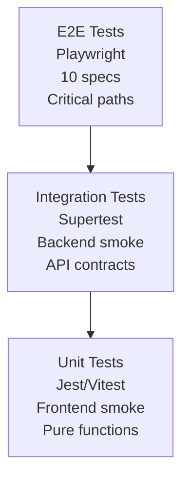

**Coverage Areas:**
- Authentication flows
- Feed pagination
- Post CRUD
- Comment threading
- Reactions
- Network actions (follow, block)

### 13.3 Reliability

**Failure Domains:**

| Domain | Failure Mode | Mitigation |
|--------|--------------|------------|
| **Cache** | Redis unavailable | Graceful degradation |
| **Database** | Mongo unavailable | Error response + logging |
| **File storage** | Disk full | Validation + error handling |
| **Workers** | Job failure | BullMQ retries + dead letter queue |
| **Network** | Timeout | Request timeout + exponential backoff |

### 13.4 Observability

**Logging Levels:**

| Level | Usage | Examples |
|-------|-------|----------|
| **error** | Errors requiring investigation | Failed DB queries, exceptions |
| **warn** | Unexpected but recoverable | Cache misses, rate limits |
| **info** | Normal business operations | User login, post creation |
| **debug** | Detailed diagnostic info | Query timing, cache hits |

**Structured Logging:**
```javascript
req.log.info(
  {
    postId: post._id,
    authorId: post.author,
    visibility: post.visibility
  },
  'post.created'
);
```

---

## 14. Architecture Decision Records

### 14.1 ADR-001: CommonJS over ES Modules

**Status:** Accepted

**Context:** Backend runs on Bun, which supports both CommonJS and ES modules.

**Decision:** Use CommonJS (`require`/`module.exports`) for backend code.

**Rationale:**
- Simpler for interview context (no import/export confusion)
- Mongoose works better with CommonJS
- No need for build step on backend

**Consequences:**
- Cannot use `import` syntax
- Must use `__dirname` and `require.resolve`
- Frontend still uses ES modules (via Vite)

---

### 14.2 ADR-002: MongoDB as Primary Database

**Status:** Accepted

**Context:** Need a database for social networking data.

**Decision:** Use MongoDB with Mongoose ODM.

**Rationale:**
- Document schema matches domain objects (posts, users)
- Flexible schema for rapid iteration
- Built-in replication for transactions
- Single-node deployment for HRW

**Alternatives Considered:**
- PostgreSQL: More rigid, but better for relational queries
- SQLite: Too simple for interview complexity

**Consequences:**
- No foreign key constraints (application-level enforcement)
- Manual cascading deletes (via Mongoose hooks)
- Transaction support requires replica set

---

### 14.3 ADR-003: Redis for Cache and Queues

**Status:** Accepted

**Context:** Need caching and background job processing.

**Decision:** Use Redis for both caching and BullMQ queue storage.

**Rationale:**
- Single infrastructure dependency
- Fast in-memory operations
- BullMQ integrates tightly with Redis
- Atomic operations for queue locks

**Consequences:**
- Redis failure degrades both cache and jobs
- Need graceful degradation patterns
- Memory consumption grows with queue depth

---

### 14.4 ADR-004: RTK Query for Data Fetching

**Status:** Accepted

**Context:** Frontend needs state management and API caching.

**Decision:** Use Redux Toolkit + RTK Query.

**Rationale:**
- Unified state management (auth + API cache)
- Automatic cache invalidation via tags
- Less boilerplate than vanilla Redux
- Good TypeScript support

**Alternatives Considered:**
- React Query: Simpler but no global state
- Apollo Client: Overkill for REST API

**Consequences:**
- Learning curve for RTK Query concepts
- Tag management requires discipline
- Auth state needs separate slice

---

### 14.5 ADR-005: Cursor Pagination

**Status:** Accepted

**Context:** Need pagination for feeds and lists.

**Decision:** Use opaque cursor-based pagination.

**Rationale:**
- Consistent performance (no offset drift)
- Works with real-time data insertion
- Opaque to client (implementation flexibility)
- Prevents duplicate/missing items

**Consequences:**
- Cannot jump to arbitrary pages
- Cursor encoding/decoding overhead
- Requires composite cursors for multi-column sorts

---

## 15. Feature Implementation Matrix

### 15.1 Implementation Status

| # | Feature | Status | PBR Seam | Notes |
|---|---------|--------|----------|-------|
| 1 | **Authentication** | Complete | No | JWT + session management |
| 2 | **User Profiles** | Complete | No | Full CRUD with subdocuments |
| 3 | **Post Feed** | Complete | Yes | Per-user caching possible |
| 4 | **Comments** | Complete | No | 1-level nesting |
| 5 | **Reactions** | Complete | No | 6 types, toggle semantics |
| 6 | **Network** | Complete | No | Follow, mute, block, connections |
| 7 | **Notifications** | Complete | Yes | Polling vs SSE |
| 8 | **Companies** | Complete | No | Profile + follow |
| 9 | **Jobs** | Complete | No | Listings + applications |
| 10 | **Uploads** | Complete | No | Image variants |
| 11 | **Messaging** | Complete | No | 1:1 conversations |
| 12 | **Search** | Complete | Yes | Naive regex ranking |
| 13 | **Analytics** | Complete | No | Dashboard + metrics |
| 14 | **Audit Logging** | Complete | No | Dual sink (DB + file) |
| 15 | **Settings** | Complete | No | Privacy + notifications |

### 15.2 Infrastructure Features

| # | Feature | Status | Implementation |
|---|---------|--------|----------------|
| 1 | **Caching** | Complete | Redis with graceful degradation |
| 2 | **Cache Invalidation** | Complete | KEYS pattern (PBR seam: replace with SCAN) |
| 3 | **Job Queues** | Complete | BullMQ with 3 workers |
| 4 | **Rate Limiting** | Complete | 3-tier with Redis store |
| 5 | **Database Indexing** | Complete | Compound + text indexes |
| 6 | **Cursor Pagination** | Complete | Opaque base64url tokens |
| 7 | **Idempotency** | Complete | Unique sparse indexes |
| 8 | **Structured Logging** | Complete | Pino with request context |
| 9 | **Health Checks** | Partial | Basic endpoint (no DB check) |
| 10 | **DB Transactions** | Complete | 5 atomic operations |
| 11 | **Retry Logic** | Complete | 4 layers (Redis, BullMQ, cache, workers) |
| 12 | **Error Handling** | Complete | Centralized error middleware |
| 13 | **API Documentation** | Complete | Swagger UI at /api/docs |
| 14 | **Input Validation** | Complete | Zod schemas |
| 15 | **HTML Sanitization** | Complete | Allowlist-based cleaning |
| 16 | **File Upload** | Complete | Multer + async processing |
| 17 | **Connection Pooling** | Complete | MongoDB: 10 max, 2 min |
| 18 | **Code Splitting** | Complete | Lazy-loaded routes |

### 15.3 PBR Seams (Task Surfaces)

Intentional weaknesses left for candidate tasks:

| Seam | Location | Current Implementation | Task Surface |
|------|----------|----------------------|--------------|
| **KEYS invalidation** | `cache.service.invalidate()` | `KEYS pattern` + `DEL` | Replace with `SCAN` cursor loop |
| **Naive search ranking** | `search.service.js` | Regex-based filtering | Replace with MongoDB `$text` + `textScore` |
| **Per-user feed cache** | `post.service.js` | Single global cache key | Add cache key per `viewerId` |
| **Health check depth** | `/api/health` endpoint | Returns static OK | Add DB + Redis status checks |
| **Polling vs SSE** | Notification polling | 30s interval | Replace with `EventSource` (SSE) |
| **Virtual scrolling** | Long lists | Native scroll + button | Add `@tanstack/virtual` |

---

## 16. Detailed Feature Implementation Reference

This section provides comprehensive implementation details for all 31 features and infrastructure components in the LinkUp platform. Each feature includes file locations, code patterns, and implementation notes.

### 16.1 Quick Implementation Status

| # | Feature | Status | Notes |
|---|---------|--------|-------|
| 1 | **Caching** | ✅ Complete | Redis with graceful degradation |
| 2 | **Cache Invalidation** | ✅ Complete | KEYS pattern (PBR seam for SCAN) |
| 3 | **Redis** | ✅ Complete | ioredis with exponential backoff |
| 4 | **Job Queues** | ✅ Complete | BullMQ with 3 workers |
| 5 | **Message Brokers** | ❌ Not Implemented | Not needed for single-user fixture |
| 6 | **Rate Limiting** | ✅ Complete | 3-tier with Redis store |
| 7 | **Throttling/Debounce** | ✅ Complete | Frontend 250ms debounce |
| 8 | **Database Indexing** | ✅ Complete | Compound, text, sparse unique |
| 9 | **Cursor Pagination** | ✅ Complete | Opaque base64url tokens |
| 10 | **Idempotency** | ✅ Complete | Unique sparse indexes |
| 11 | **Audit Logging** | ✅ Complete | Dual sink (DB + file) |
| 12 | **Structured Logging** | ✅ Complete | Pino with request context |
| 13 | **Health Checks** | ⚠️ Partial | No DB/Redis status checks |
| 14 | **Search Systems** | ✅ Complete | Full-text + regex with filters |
| 15 | **Recommendation Systems** | ✅ Complete | 2nd-degree graph traversal |
| 16 | **State Management** | ✅ Complete | Redux Toolkit + RTK Query |
| 17 | **Infinite Scrolling** | ✅ Complete | Cursor merge + button trigger |
| 18 | **Lazy Loading** | ✅ Complete | Route code split + img lazy |
| 19 | **Code Splitting** | ✅ Complete | Manual vendor chunks |
| 20 | **Rendering Optimization** | ⚠️ Partial | Memo, callbacks, no virtual |
| 21 | **Skeleton Loading** | ✅ Complete | ListSkeleton + page skeletons |
| 22 | **Drag-and-Drop** | ✅ Complete | @dnd-kit for 3 surfaces |
| 23 | **Rich Text Editors** | ✅ Complete | Tiptap v3 with mentions |
| 24 | **Background Jobs** | ✅ Complete | 3 workers + repeatable tasks |
| 25 | **Redux Toolkit + RTK Query** | ✅ Complete | 15 API slices, 18 tags |
| 26 | **Rate Limiting + Redis** | ✅ Complete | Lazy init pattern |
| 27 | **SSE** | ❌ Not Implemented | Polling used instead |
| 28 | **Helmet + CORS** | ✅ Complete | Hardened headers |
| 29 | **Connection Pooling** | ✅ Complete | 10 max, 2 min, 30s idle |
| 30 | **DB Transactions** | ✅ Complete | 5 atomic operations |
| 31 | **Retry Mechanisms** | ✅ Complete | 4 layers of retry logic |

**Summary:** 27/31 fully implemented · 2 partial · 2 not implemented

---

### 16.2 Infrastructure Features Deep Dive

#### Feature 1: Caching ✅

**Implementation Location:**
- `backend/src/shared/services/cache.service.js` (core service)
- `backend/src/features/post/post.cache.js` (domain cache)

**How It Works:**
- Centralized `cache.service.js` wraps ioredis with `get(key)`, `set(key, value, ttlSeconds)`, `del(key)`, `invalidate(pattern)` methods
- `post.cache.js` defines TTL constants and namespaced key builders per domain:
  - `feed:home:public:*` — 30s (public feed, high churn)
  - `feed:profile:<id>:*` — 60s
  - `post:<id>` — 120s
  - `notifications:unread:<id>` — 30s
  - `network:suggestions:<id>` — 60s

**Pattern - Cache-Aside with Graceful Degradation:**
```javascript
// cache.service.js — get with fallback
async function get(key) {
  try {
    const v = await getRedis().get(key);
    return v ? JSON.parse(v) : null;
  } catch (err) {
    baseLogger.warn({ err: err.message, key }, "[cache] get failed — treating as miss");
    return null;  // degrade gracefully
  }
}

// Service-layer usage
const cached = await cache.get(key);
if (cached) return cached;
const result = await Model.find(...);
await cache.set(key, result, TTL);
return result;
```

**All cache operations wrapped in try/catch** — Redis errors return `null`/no-op instead of crashing requests.

---

#### Feature 2: Cache Invalidation ✅

**Implementation Location:**
- `backend/src/shared/services/cache.service.js` (lines 16–29)
- `backend/src/features/post/post.cache.js` (lines 48–68)

**How It Works:**
- Single-key deletion via `cache.del(key)`
- Wildcard invalidation via `cache.invalidate(pattern)` — executes `KEYS pattern` then pipelines `DEL` on matches
- `post.cache.js` exports `invalidateForPost(postId, authorId)` which deletes the post key plus all feed variants for the author
- Comment, reaction, and repost services call `invalidateForPost()` after every mutation

**Known PBR Seam:** `KEYS` scans the full keyspace (fine for single-user fixture). Production replacement is a `SCAN`-based cursor loop.

**Pattern - Wildcard Invalidation:**
```javascript
// cache.service.js
async invalidate(pattern) {
  const keys = await redis.keys(pattern);   // PBR seam: KEYS not SCAN
  if (keys.length) await redis.del(...keys);
}
```

---

#### Feature 3: Redis Configuration ✅

**Implementation Location:**
- `backend/src/shared/config/redis.js`

**Configuration:**
- `maxRetriesPerRequest: null` — required by BullMQ for blocking commands
- `enableReadyCheck: true` — waits for server READY before resolving
- `lazyConnect: false` — connects eagerly on startup
- `retryStrategy: (times) => Math.min(100 * 2 ** times, 10_000)` — exponential reconnect backoff capped at 10s

**Pattern - Redis Connection:**
```javascript
_client = new Redis(redisUrl, {
  maxRetriesPerRequest: null,  // BullMQ requires null for blocking commands
  enableReadyCheck: true,
  lazyConnect: false,
  retryStrategy: (times) => Math.min(100 * 2 ** times, 10_000),
});
```

---

#### Feature 4: Job Queues ✅

**Implementation Location:**
- `backend/src/shared/config/queues.js` (queue factory)
- Worker files in `backend/src/features/`

**Three BullMQ Queues:**

| Queue | Worker File | Purpose | Attempts | Backoff |
|-------|-------------|---------|----------|---------|
| `notifications` | `features/notification/notification.worker.js` | Fan-out notification records | 3 | exponential, 1s |
| `image-processing` | `features/upload/image-processing.worker.js` | Generate thumb/medium variants | 3 | exponential, 2s |
| `maintenance` | `features/maintenance/maintenance.worker.js` | Repeatable: orphan sweep, cache refresh | N/A | N/A |

**Repeatable Jobs:**
- **orphan-upload-sweep** — every 15 min, deletes uploads with `committed: false` older than 1 hour
- **cache-refresh** — every 5 min, warms public feed cache

**Job Configuration:**
```javascript
await queue.add("fanout", args, {
  attempts: 3,
  backoff: { type: "exponential", delay: 1_000 },
  removeOnComplete: { count: 100, age: 3600 },
  removeOnFail: { count: 50, age: 86400 },
});
```

---

#### Feature 6: Rate Limiting ✅

**Implementation Location:**
- `backend/src/shared/middleware/rateLimit.middleware.js`
- Applied in `backend/src/app.js` (line ~109)

**Three-Tier Strategy:**

| Limiter | Window | Limit | Applied To |
|---------|--------|-------|------------|
| `globalLimiter` | 15 min | 300 req/IP | All `/api/*` routes |
| `authLimiter` | 15 min | 15 req/IP | `/api/auth/login`, `/api/auth/signup` |
| `sensitiveAuthLimiter` | 60 min | 5 req/IP | `/api/auth/forgot-password` |

**Lazy-Init Pattern:** `express-rate-limit` calls `store.init()` synchronously at module load (before Redis connects). The store wrapper makes `init()` a no-op that saves opts; actual `RedisStore` is constructed on the first real request.

**Pattern - Lazy RedisStore Init:**
```javascript
function makeStore(prefix) {
  return {
    init(opts) { _storedOpts.set(prefix, opts); },         // no-op, saves opts
    async increment(key) { return getStore(prefix).increment(key); }, // real Redis call
  };
}
```

---

#### Feature 7: Throttling/Debounce ✅

**Implementation Location:**
- `frontend/src/hooks/useDebouncedValue.js`
- `frontend/src/components/ui/mentionSuggestion.js`
- `frontend/src/features/search/components/SearchBar.jsx`

**How It Works:**
- `useDebouncedValue(value, delay)` — generic React hook using `useEffect` + `setTimeout`
- Search bar uses `DEBOUNCE_MS = 250ms` to avoid firing API on every keystroke
- `mentionSuggestion.js` has custom debounce around autocomplete fetch

**Pattern - Debounce Hook:**
```javascript
function useDebouncedValue(value, delay = 250) {
  const [debounced, setDebounced] = useState(value);
  useEffect(() => {
    const id = setTimeout(() => setDebounced(value), delay);
    return () => clearTimeout(id);
  }, [value, delay]);
  return debounced;
}
```

---

#### Feature 8: Database Indexing ✅

**Implementation Location:**
- All `*.model.js` files in `backend/src/features/`

**Index Types Used:**

| Type | Example | Purpose |
|------|---------|---------|
| **Compound** | `(visibility, created_at)` on Post | Feed queries with sort |
| **Compound** | `(author_id, created_at)` on Post | Profile feed queries |
| **Text** | `{ content: "text" }` on Post | Full-text post search |
| **Text (weighted)** | `{ title: "text", description: "text" }` on Job | Full-text job search with field weights |
| **Sparse unique** | `(recipient, dedupe_key)` on Notification | Notification deduplication |
| **Sparse unique** | `(author, repost_of)` with partial filter | Repost uniqueness (bare reposts only) |

**All indexes declared in `schema.index()` calls** at the bottom of each model file.

---

#### Feature 9: Cursor Pagination ✅

**Implementation Location:**
- `backend/src/shared/lib/pagination.js`

**How It Works:**
- `parseCursor(cursor)` — decodes base64url string into `{ id, createdAt }` (default) or `{ name, id }` (name-sorted)
- `buildEnvelope(items, limit, options)` — fetches `limit + 1` items, trims extra, builds `{ items, nextCursor, hasMore }`
- Cursors are opaque to the client (base64url-encoded JSON)
- Two cursor shapes: `(created_at, _id)` for time-sorted, `(name, _id)` for alphabetically-sorted

**Pattern - Build Envelope:**
```javascript
function buildEnvelope(items, limit) {
  const hasMore = items.length > limit;
  const visible = hasMore ? items.slice(0, limit) : items;
  const last = visible[visible.length - 1];
  return {
    items: visible,
    nextCursor: hasMore ? encodeCursor({ id: last._id, createdAt: last.created_at }) : null,
    hasMore,
  };
}
```

---

#### Feature 10: Idempotency ✅

**Implementation Location:**
- `backend/src/features/notification/notification.model.js`
- `backend/src/features/post/post.model.js`
- `backend/src/features/network/network.service.js`

**Mechanisms Used:**

| Mechanism | Location | What It Guards |
|-----------|----------|----------------|
| `(recipient, dedupe_key)` unique sparse | Notification model | Duplicate notifications |
| `(author, repost_of)` unique sparse | Post model (partial filter) | Duplicate bare reposts |
| `findOneAndUpdate({ upsert: true })` | network.service | Follow/mute/block toggle |
| `findOneAndUpdate({ upsert: true })` | job application service | Duplicate job applications |

**Dedupe keys** encode `(actor, action, target)` — e.g., `like:postId:actorId`. Changing reaction emoji changes the key, treating emoji-change as new notification.

---

#### Feature 11: Audit Logging ✅

**Implementation Location:**
- `backend/src/features/audit/audit.service.js`
- `backend/src/features/audit/audit.model.js`
- `backend/src/shared/lib/logger.js` (lines 53–83)

**How It Works:**
- `auditService.record({ actor, action, targetType, targetId, ip, userAgent, requestId, metadata })` — always called fire-and-forget from mutating controllers
- Writes to **two sinks simultaneously:**
  1. **MongoDB** — `Audit` collection, queryable via `GET /api/audit/me`
  2. **Rotating log file** — `logs/audit-YYYY-MM-DD.log`, JSON lines via dedicated pino `auditLogger`
- Never blocks user-facing response — if `auditService.record()` throws, error is caught and swallowed silently

**Pattern - Fire-and-Forget Audit:**
```javascript
const post = await postService.create(req.user.id, body);
auditService.record({ actor: req.user.id, action: 'post.create', targetId: post.id, ... }).catch(() => {});
res.status(201).json({ data: post });
```

---

#### Feature 12: Structured Logging ✅

**Implementation Location:**
- `backend/src/shared/lib/logger.js`
- `backend/src/shared/middleware/requestContext.middleware.js`

**How It Works:**
- **`baseLogger`** — pino instance with JSON output in production, pretty-print in dev
- Redaction paths: `req.headers.authorization`, `body.password`, `body.token` (never logged in plaintext)
- **`auditLogger`** — separate pino instance writing to date-rotated files
- **`requestContext.middleware.js`** — mints `req.id` (nanoid 10 chars), attaches `req.log` child logger

**Pattern - Structured Logging:**
```javascript
// In any service or controller
req.log.info({ userId: req.user.id, postId: post.id }, 'post.created');

// baseLogger for non-request contexts
baseLogger.error({ err }, 'worker.failed');
```

---

#### Feature 13: Health Checks ⚠️ Partial

**Implementation Location:**
- `backend/src/app.js` (GET `/api/health`)

**What's Implemented:**
```json
{ "ok": true, "service": "linkup-api", "env": "development", "uptime": 42.3, "timestamp": "..." }
```

**What's Missing:**
- No `mongoose.connection.readyState === 1` check
- No `redis.ping()` check
- No memory/CPU stats

**Production-Grade Addition:**
```javascript
const dbOk = mongoose.connection.readyState === 1;
const redisOk = await getRedis().ping().then(() => true).catch(() => false);
res.status(dbOk && redisOk ? 200 : 503).json({ ok: dbOk && redisOk, db: dbOk, redis: redisOk });
```

---

#### Feature 14: Search Systems ✅

**Implementation Location:**
- `backend/src/features/search/search.service.js`
- `backend/src/features/search/search.routes.js`

**Four Search Surfaces:**

| Surface | Strategy | Endpoint |
|---------|----------|---------|
| People | Regex (word-boundary) | `GET /api/search?q=&type=people` |
| Posts | MongoDB `$text` full-text | `GET /api/search?q=&type=posts` |
| Jobs | MongoDB `$text` full-text | `GET /api/search?q=&type=jobs` |
| Companies | Regex (word-boundary) | `GET /api/search?q=&type=companies` |
| Autocomplete | Prefix regex, top N per type | `GET /api/search/autocomplete?q=` |

**How It Works:**
- People/companies: `new RegExp(\`\\b${escapeRegex(q)}\`, 'i')` — word-boundary anchored, case-insensitive
- Posts/jobs: `{ $text: { $search: q } }` — uses MongoDB text index, ranked by `$meta: 'textScore'`
- All search paths apply block/mute/deactivated/visibility filters before returning
- `escapeRegex()` from `shared/lib/regex.js` prevents regex injection

**Autocomplete (`autocompleteAll`):**
- Runs three parallel prefix-regex lookups: people, companies, jobs
- `perType = Math.max(2, Math.ceil(limit / 3))` — distributes result limit evenly
- Each result carries `itemType: "person" | "company" | "job"` for frontend routing/rendering

---

#### Feature 15: Recommendation Systems ✅

**Implementation Location:**
- `backend/src/features/network/network.service.js` (`getSuggestions()`)

**How It Works:**
- Finds all users the viewer follows (1st-degree)
- Finds everyone those users follow (2nd-degree graph traversal)
- Excludes: already-followed, self, blocked, muted, deactivated accounts
- Sorts by mutual connection count
- Result cached per viewer at `network:suggestions:<viewerId>` with 60s TTL
- Tagged with `degree: "2nd"` in API response

---

#### Feature 16: State Management ✅

**Implementation Location:**
- `frontend/src/store/index.js`
- `frontend/src/store/baseApi.js`
- `frontend/src/features/auth/store/authSlice.js`

**Architecture:**
- **Redux Toolkit** `configureStore` with two reducers:
  - `auth` — `authSlice` managing `{ token, user, hydrating }` state
  - `[baseApi.reducerPath]` — RTK Query cache
- **RTK Query** is the sole data layer — no raw `fetch` or `axios` calls
- **`baseApi.js`** configures:
  - `fetchBaseQuery` with `prepareHeaders` injecting `Authorization: Bearer <token>`
  - `responseHandler` unwrapping `{ data: ... }` envelope
  - 401 interceptor: dispatches `clearCredentials()` only when token was present
  - 18 tag types for cache invalidation

**Pattern - Feature Slice:**
```javascript
const postApi = baseApi.injectEndpoints({
  endpoints: (build) => ({
    getHomeFeed: build.query({
      query: ({ cursor, limit }) => `/posts/feed?cursor=${cursor}&limit=${limit}`,
      providesTags: ['Feed'],
      serializeQueryArgs: ({ endpointName }) => endpointName,
      merge: (cache, incoming) => { cache.items.push(...incoming.items); cache.nextCursor = incoming.nextCursor; },
      forceRefetch: ({ currentArg, previousArg }) => currentArg?.cursor !== previousArg?.cursor,
    }),
  }),
});
```

---

#### Feature 17: Infinite Scrolling ✅

**Implementation Location:**
- `frontend/src/features/post/store/postApi.js`
- `frontend/src/features/post/hooks/useHomeFeed.js`

**How It Works:**
- RTK Query `getHomeFeed` endpoint uses **merge + serializeQueryArgs + forceRefetch** pattern
- `useHomeFeed` hook exposes `{ posts, isLoading, isFetching, hasMore, loadMore }`
- `loadMore()` sets `cursor` to `nextCursor` returned by API
- Load-more is **button-driven** (not IntersectionObserver auto-scroll)

---

#### Feature 18: Lazy Loading ✅

**Implementation Location:**
- `frontend/src/App.jsx`
- All image-rendering components

**Two Forms:**

1. **Route-level code splitting** — Every page component wrapped in `React.lazy(() => import('./pages/SomePage'))`. Suspense boundary in `App.jsx` shows `<ListSkeleton />` while chunk loads.

2. **Image lazy loading** — Every `` carries `loading="lazy" decoding="async"` in:
   - `PostImages.jsx` — post image carousel
   - `ActivityCard.jsx` — profile activity thumbnails
   - `AvatarImage.jsx` — user avatars
   - All profile/company header images

**Pattern - Route Lazy Loading:**
```jsx
const HomePage = lazy(() => import('./features/post/pages/HomePage'));

<Suspense fallback={<ListSkeleton />}>
  <Routes>
    <Route path="/" element={<HomePage />} />
  </Routes>
</Suspense>
```

---

#### Feature 19: Code Splitting ✅

**Implementation Location:**
- `frontend/vite.config.js`
- `frontend/src/App.jsx`

**Two Layers:**

1. **Route-level splitting** — `React.lazy` on every page (40+ routes) produces per-page JS chunks

2. **Manual vendor chunks** (in `vite.config.js`):

| Chunk | Contents | Why |
|-------|----------|-----|
| `react-vendor` | react, react-dom, react-router | Core, never changes |
| `redux-vendor` | @reduxjs/toolkit, react-redux | State management, stable |
| `ui-vendor` | radix-ui, lucide-react, @dnd-kit, @tiptap | UI deps, co-change |
| `date-vendor` | date-fns | Utility, stable |

- Chunk size warning threshold bumped to 800kB (Tiptap is large)
- Long-lived Cache-Control headers on vendor chunks (content-hashed filenames)

---

#### Feature 21: Skeleton Loading ✅

**Implementation Location:**
- `frontend/src/components/ui/ListSkeleton.jsx`
- `frontend/src/features/analytics/pages/AnalyticsPage.jsx`

**How It Works:**
- `ListSkeleton` — reusable component accepting `{ rows = 3, height = 'h-24' }` props
- Used as:
  - Suspense fallback in `App.jsx` (route chunk loading)
  - Loading state in paginated list pages while first page fetches
- `AnalyticsPage` has custom `DashboardSkeleton` matching analytics grid layout
- RTK Query `isLoading` (first load) vs `isFetching` (subsequent loads) allows showing skeleton only on initial load

---

#### Feature 22: Drag-and-Drop Systems ✅

**Implementation Location:**
- `frontend/src/features/profile/pages/SkillsEditorPage.jsx`
- `frontend/src/features/profile/pages/FeaturedEditorPage.jsx`
- `frontend/src/features/upload/components/ImagePicker.jsx`

**Library:** `@dnd-kit/core` + `@dnd-kit/sortable` + `@dnd-kit/utilities`

**Three Drag Surfaces:**

| Surface | Component | What's Reordered |
|---------|-----------|------------------|
| Skills editor | `SkillsEditorPage` | Profile skills list |
| Featured editor | `FeaturedEditorPage` | Featured posts/links/media |
| Image picker | `ImagePicker` | Uploaded image order for posts |

**How It Works:**
- `DndContext` + `SortableContext` wrap the list
- Each item uses `useSortable(id)` hook
- `PointerSensor` (mouse/touch) + `KeyboardSensor` (accessibility) both registered
- `onDragEnd` callback reorders local state and fires save API call

---

#### Feature 23: Rich Text Editors ✅

**Implementation Location:**
- `frontend/src/components/ui/RichTextEditor.jsx`
- `frontend/src/components/ui/mentionSuggestion.js`
- `frontend/src/components/ui/EditorField.jsx`

**Library:** `@tiptap/react` v3 (v3 API differs from v2)

**Extensions Loaded:**
- `StarterKit` — bold, italic, headings, lists, blockquote, hard-break
- `Link` — inline hyperlinks with `rel="noopener noreferrer"`
- `Mention` (custom) — `@user` mentions with `data-mention` + `data-user-id` attributes
- `Placeholder` — grey hint text when editor is empty
- `CharacterCount` — tracks character count for validation

**Custom Mention Node:**
- `parseHTML` matches `span[data-mention][data-user-id]`
- `renderHTML` returns `['span', { 'data-mention': true, 'data-user-id': id }, '@${name}']`
- `mentionSuggestion.js` debounces autocomplete API call

**Used in:** Post composer, job description editor, comment text input

---

#### Feature 24: Background Jobs ✅

**Implementation Location:**
- `backend/src/features/notification/notification.worker.js`
- `backend/src/features/upload/image-processing.worker.js`
- `backend/src/features/maintenance/maintenance.worker.js`

**Three Workers:**

**Notification Fanout Worker:**
- Queue: `notifications`
- Processor: `notificationService.recordFanout(job.data)`
- Triggered by: `notify.fanout()` in any service
- Creates `Notification` documents for each recipient; dedupe key prevents duplicates

**Image Processing Worker:**
- Queue: `image-processing`
- Triggered by: Upload controller after `multer` saves original
- What it does:
  1. Reads original from `backend/uploads/originals/<uploadId>`
  2. `sharp(original).resize(200).webp().toFile(...)` → thumb variant
  3. `sharp(original).resize(800).webp().toFile(...)` → medium variant
  4. Marks upload record as `processed: true`

**Maintenance Worker:**
- Queue: `maintenance` (repeatable)
- **orphan-upload-sweep** (every 15 min): deletes uploads with `committed: false` older than 1 hour
- **cache-refresh** (every 5 min): rebuilds public home feed cache

---

#### Feature 25: Redux Toolkit + RTK Query ✅

**Implementation Location:**
- `frontend/src/store/baseApi.js`
- `frontend/src/store/index.js`
- `frontend/src/features/auth/store/authSlice.js`

**How It Works:**
- `createApi` in `baseApi.js` defines global API instance shared by all feature slices
- Feature slices call `baseApi.injectEndpoints({ endpoints })`
- `fetchBaseQuery` handles all HTTP mechanics:
  - `prepareHeaders`: injects `Authorization: Bearer <token>`
  - Response handler: unwraps `{ data }` envelope, normalizes errors
  - 401 handler: dispatches `clearCredentials()` only if token existed
- Cache is tag-based: endpoints declare `providesTags`, mutations declare `invalidatesTags`
- Optimistic updates via `updateQueryData` in comment/reaction mutations

**Auth Slice:**
- State: `{ token: null, user: null, hydrating: true }`
- `setCredentials({ token, user })` — called on login/signup/refresh
- `clearCredentials()` — called on logout or 401
- `hydrating` flag prevents `RequireAuth` from redirecting before localStorage is read

---

#### Feature 26: Rate Limiting + Redis Store ✅

**Implementation Location:**
- `backend/src/shared/middleware/rateLimit.middleware.js`

**Key Implementation — Lazy RedisStore Init:**

`express-rate-limit` calls `store.init(opts)` synchronously when `rateLimit()` is called — which happens at module evaluation time, before `connectRedis()` has run.

**Fix Pattern:**
```javascript
const _stores = new Map();
const _storedOpts = new Map();

function makeStore(prefix) {
  return {
    init(opts) { _storedOpts.set(prefix, opts); },  // no-op — just saves opts
    async increment(key) { return getStore(prefix).increment(key); },
  };
}

function getStore(prefix) {
  if (!_stores.has(prefix)) {
    const store = new RedisStore({ sendCommand: (...a) => getRedis().call(...a), prefix });
    if (_storedOpts.has(prefix) && store.init) store.init(_storedOpts.get(prefix));
    _stores.set(prefix, store);
  }
  return _stores.get(prefix);
}
```

---

#### Feature 28: Helmet + CORS Hardening ✅

**Implementation Location:**
- `backend/src/app.js` (lines ~26–42)
- `backend/src/shared/config/index.js` (lines ~47–49)

**Helmet:**
- `helmet()` applied as first middleware after Express setup
- Sets: `X-Content-Type-Options: nosniff`, `X-Frame-Options: SAMEORIGIN`, `Strict-Transport-Security`, etc.
- **CSP is disabled** (`contentSecurityPolicy: false`) — Swagger UI uses inline scripts

**CORS:**
```javascript
cors({
  origin(origin, cb) {
    if (!origin || config.allowedOrigins.includes(origin)) return cb(null, true);
    cb(new Error('Not allowed by CORS'));
  },
  methods: ['GET', 'POST', 'PUT', 'PATCH', 'DELETE', 'OPTIONS'],
  credentials: true,
  allowedHeaders: ['Content-Type', 'Authorization'],
  exposedHeaders: ['RateLimit-Limit', 'RateLimit-Remaining', 'RateLimit-Reset'],
})
```

---

#### Feature 29: Connection Pooling ✅

**Implementation Location:**
- `backend/src/shared/config/db.js`

**Pool Options:**

| Option | Value | Purpose |
|--------|-------|---------|
| `maxPoolSize` | 10 | Maximum concurrent connections |
| `minPoolSize` | 2 | Keep at least 2 connections alive |
| `maxIdleTimeMS` | 30 000 | Close idle connections after 30s |
| `serverSelectionTimeoutMS` | 10 000 | Fail fast if no server available |
| `connectTimeoutMS` | 10 000 | Abort initial connection after 10s |
| `socketTimeoutMS` | 45 000 | Abort hanging queries after 45s |
| `waitQueueTimeoutMS` | 10 000 | Fail if no pool slot available in 10s |

**Pool Monitoring:**
- `connectionCheckOutFailed` — logged at warn level (pool exhaustion visible in logs)
- `connectionPoolCleared` — logged at warn level (pool resets visible for post-incident analysis)

---

#### Feature 30: DB Transactions ✅

**Implementation Location:**
- `backend/src/shared/lib/transaction.js`
- Service files with multi-step writes

**How It Works:**
- `withTransaction(fn)` utility wraps `session.withTransaction()` and ensures `session.endSession()` always runs
- **Graceful fallback:** If MongoDB is not a replica set (transactions unavailable), `withTransaction` detects `IllegalOperation` error, logs warning, runs callback without session
- **MongoDB replica set prerequisite:** `connectDB()` issues `{ replSetInitiate: {} }` once at startup
- **Cascade deletes moved from Mongoose hooks to service layer** — session-aware cascade logic lives in service

**Five Atomic Operations:**

| Operation | File | What's in Transaction |
|-----------|------|----------------------|
| Post delete | `features/post/post.service.js → deletePost()` | Cascade (reposts, reactions, comments) + Post.deleteOne |
| User delete | `features/user/user.service.js → deleteUser()` | All post cascades + user-owned data + User.deleteOne |
| Connection accept | `features/network/connection.service.js → acceptInvite()` | Invite status + both Follow upserts |
| Draft publish | `features/post/draft.service.js → publish()` | Upload commit + Post.create + Draft.deleteOne |
| Block user | `features/network/network.service.js → block()` | Block upsert + Follow deletes + Mute deletes |

**Side Effects (Intentionally Outside Transactions):**
- `notify.fanout()` — BullMQ enqueue, not MongoDB write
- `postCache.invalidateForAuthor()` — Redis, not MongoDB
- `uploadService.deleteByIds()` — filesystem delete, executed after commit

---

#### Feature 31: Retry Mechanisms ✅

**Four Retry Layers:**

**1. Redis Reconnect Resilience** (`backend/src/shared/config/redis.js`)
- `retryStrategy: (times) => Math.min(100 * 2 ** times, 10_000)` — exponential backoff capped at 10s
- ioredis automatically replays pending commands after reconnect

**2. BullMQ Job Retry**
- All enqueued jobs specify `attempts: 3` + `backoff: { type: "exponential", delay: N }`
- Notification jobs: 1s → 2s → 4s
- Image-processing jobs: 2s → 4s → 8s
- After all attempts, job moves to BullMQ's failed set

**3. Cache Service Error Resilience** (`backend/src/shared/services/cache.service.js`)
- All cache operations wrapped in try/catch
- `get` returns `null` on error (treated as cache miss)
- `set`/`del`/`invalidate` log warn and return silently

**4. Image-Processing Worker Error Handling** (`backend/src/features/upload/image-processing.worker.js`)
- Sharp processing loop wrapped in try/catch
- On failure: logs with attempt number, re-throws for BullMQ retry

**Pattern - BullMQ Job with Retry:**
```javascript
await queue.add("fanout", args, {
  attempts: 3,
  backoff: { type: "exponential", delay: 1_000 },
  removeOnComplete: { count: 100, age: 3600 },
  removeOnFail: { count: 50, age: 86400 },
});
```

---

### 16.3 Gaps and Future Improvements

| Gap | Impact | Fix Complexity | Priority |
|-----|--------|---------------|----------|
| **Message brokers (❌)** | Low — single-user app | Medium — add Redis pub/sub for SSE | Low |
| **SSE (❌)** | Low — polling works | Medium — requires Redis pub/sub + EventSource | Low |
| **Health checks depth (⚠️)** | Medium — can't detect outages | Low — add `mongoose.readyState` + `redis.ping()` | High |
| **React.memo / windowing (⚠️)** | Low — single-user, small datasets | Medium — wrap components in memo, add react-virtual | Medium |

---

### 16.4 Feature Location Reference

Quick lookup: every feature mapped to exact files.

**Caching:**
- Core: `backend/src/shared/services/cache.service.js`
- Domain: `backend/src/features/post/post.cache.js`

**Job Queues:**
- Setup: `backend/src/shared/config/queues.js`
- Workers: `backend/src/features/*/notification.worker.js`, `image-processing.worker.js`, `maintenance.worker.js`

**Rate Limiting:**
- Middleware: `backend/src/shared/middleware/rateLimit.middleware.js`
- Application: `backend/src/app.js`

**Search:**
- Service: `backend/src/features/search/search.service.js`
- Frontend: `frontend/src/features/search/pages/SearchResultsPage.jsx`

**State Management:**
- Store: `frontend/src/store/index.js`
- Base API: `frontend/src/store/baseApi.js`
- Auth: `frontend/src/features/auth/store/authSlice.js`

**Database Transactions:**
- Utility: `backend/src/shared/lib/transaction.js`
- Usage: All service files with multi-step writes

---

## 17. Appendices

### Appendix A: Environment Variables

#### Backend Variables

| Variable | Type | Default | Description |
|----------|------|---------|-------------|
| `NODE_ENV` | string | `development` | Environment mode |
| `PORT` | number | `8000` | Server port |
| `MONGODB_URI` | string | `mongodb://localhost:27017/linkup` | MongoDB connection string |
| `REDIS_URL` | string | `redis://localhost:6379` | Redis connection string |
| `ALLOWED_ORIGINS` | string | `http://localhost:3000` | CORS allowed origins |
| `JWT_SECRET` | string | `dev-secret-change-in-prod` | JWT signing secret |
| `JWT_EXPIRES_IN` | string | `7d` | JWT expiration |
| `LOG_LEVEL` | string | `info` | Pino log level |

#### Frontend Variables

| Variable | Type | Default | Description |
|----------|------|---------|-------------|
| `VITE_API_BASE` | string | `/api` | API base path |
| `VITE_ENABLE_ANALYTICS` | boolean | `false` | Enable analytics feature |

### Appendix B: Common Commands

#### Development Commands

```bash
# Install dependencies (runs setup.sh)
bun install

# Start both servers
bun start

# Backend only
cd backend && bun run dev

# Frontend only
cd frontend && bun run dev

# Run tests
bun test              # All tests
cd backend && bun test    # Backend smoke
cd frontend && bun test   # Frontend smoke
cd tests && bun test      # E2E (requires running servers)

# Linting
bun run lint

# Build for production
bun run build:frontend

# Data management
bun run seed           # Seed DB (idempotent)
bun run reset-data     # Drop + reseed
```

#### Database Commands

```bash
# MongoDB shell
mongosh linkup

# Check indexes
db.posts.getIndexes()
db.users.getIndexes()

# Profile queries
db.setProfilingLevel(2)
db.system.profile.find().sort({ts:-1}).limit(5)
```

#### Redis Commands

```bash
# Redis CLI
redis-cli

# Monitor commands
MONITOR

# Check cache keys
KEYS linkup:*

# Flush cache
FLUSHDB
```

### Appendix C: Critical Files Reference

#### Backend Entry Points

| File | Purpose |
|------|---------|
| `backend/src/index.js` | Application entry, init DB/Redis/queues |
| `backend/src/app.js` | Express app, middleware mount |
| `backend/src/shared/config/db.js` | MongoDB connection |
| `backend/src/shared/config/redis.js` | Redis connection |
| `backend/src/shared/config/queues.js` | BullMQ setup |

#### Frontend Entry Points

| File | Purpose |
|------|---------|
| `frontend/src/main.jsx` | React app mount |
| `frontend/src/App.jsx` | Route definitions |
| `frontend/src/store/baseApi.js` | RTK Query base API |
| `frontend/vite.config.js` | Build configuration |

#### Shared Infrastructure

| File | Purpose |
|------|---------|
| `backend/src/shared/services/cache.service.js` | Cache operations |
| `backend/src/shared/services/notification.service.js` | Notification fanout |
| `backend/src/shared/lib/pagination.js` | Cursor pagination |
| `backend/src/shared/lib/errors.js` | Error classes |
| `backend/src/shared/middleware/auth.middleware.js` | Authentication |
| `backend/src/shared/middleware/error.middleware.js` | Error handling |

### Appendix D: Seeded Accounts

All seeded accounts share password: **`password123`**

| Email | Role | Purpose |
|-------|------|---------|
| `alex.morgan@linkup.com` | Admin | Canonical viewer account |
| `sarah.chen@linkup.com` | User | Active poster |
| `m.johnson@linkup.com` | User | Network hub |
| `emily.rodriguez@linkup.com` | User | Job seeker |
| `david.kim@linkup.com` | User | Company representative |
| `lisa.thompson@linkup.com` | User | Casual user |
| `james.wilson@linkup.com` | User | Commenter |
| `maria.garcia@linkup.com` | User | New user |

### Appendix E: Troubleshooting

#### Common Issues

| Issue | Symptom | Solution |
|-------|---------|----------|
| **MongoDB not running** | Connection refused | Run `sudo systemctl start mongod` |
| **Redis not running** | Cache failures | Run `redis-server` or `sudo systemctl start redis` |
| **Port in use** | EADDRINUSE | Change PORT in .env or kill process |
| **CORS errors** | Blocked requests | Check ALLOWED_ORIGINS in .env |
| **Workers not processing** | Jobs stuck | Check Redis connection, worker logs |

#### Debug Mode

```bash
# Enable debug logging
LOG_LEVEL=debug bun start

# MongoDB profiling
mongosh linkup --eval "db.setProfilingLevel(2)"

# Redis monitor
redis-cli MONITOR
```

---

## Document Control

| Version | Date | Author | Changes |
|---------|------|--------|---------|
| 1.0.0 | 2025-05-15 | LinkUp Team | Initial comprehensive architecture documentation |

---

**End of Architecture Document**

For questions or contributions, please refer to the project README.md or contact the LinkUp development team.
